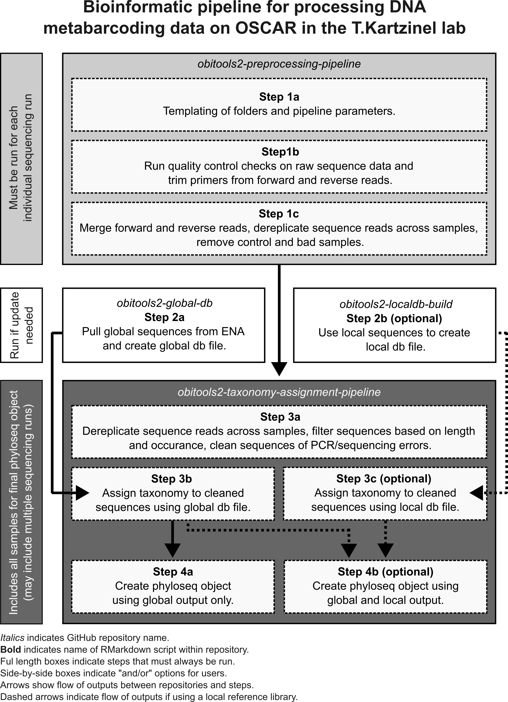

# obitools2-taxonomy-assignment

This repository contains the code for assigning taxonomy to DNA metabarcoding data with OBITools v.1.2.12 on Brown's high-performance cluster, OSCAR. 

**Note:** Taxonomic assignment steps are run all samples that a user wants to include in final analyses (i.e. this may include samples from multiple sequencing runs). 

The steps included in this repository:

1. collect outputs from step 1c for sequencing runs that a user wants to use in final analyses and filter sequences (step 3a)

2. assign taxonomy to sequencing reads using global reference library (step 3b)

3. optional step: assign taxonomy to sequencing reads using local reference library (step 3c)

4. create phyloseq object using taxonomy assignment from **global** reference library (step 4a)

5. create phyloseq object using taxonomy assignment from **global and local** reference libraries (step 4b)

The schematic below shows the entire bioinformatic pipeline for DNA metabarcoding data, but the steps included in this repository are shown in the dark grey box. 

## Connecting to Oscar

- [ ] If not on campus, make sure you are connected to the Brown [VPN](https://it.brown.edu/services/virtual-private-network-vpn)
- [ ] Navigate to the link in #1 and choose R version 4.3.1.
- [ ] Under Modules put `git miniconda3`.
- [ ] Launch the session once it has been allocated. 
- [ ] Go to the terminal pane in RStudio and `cd /oscar/data/tkartzin/<your folder>` (replace <your folder> with your user folder here)
- [ ] In that terminal `git clone https://github.com/trklab-metabarcoding/obitools2-preprocessing-pipeline.git`
- [ ] Also in the terminal: `cd obitools2-preprocessing-pipeline`
- [ ] In the Files panes of RStudio, use the menu at the top right to make sure you are also at the same path.
- [ ] Double-click the `.obitools2-pipeline.Rproj` file to set the project working directory. All of the notebooks are built from this working directory.

## Prepare your sample metadata

For step 4, you need to create a sample metadata sheet for all the samples to be included in your phyloseq object. In the parent directory, take a look at the `sample_metadata.xlsx` as an example and the fill out `sample_metadata_blank.xlsx` with your own metadata (add/remove columns as appropriate for your dataset). Leave the sample metadata in the root directory of the repo.

## Running the Notebooks for Steps 3 and 4:

### Step 3a. `Step3a_data_cleaning.Rmd`
The first step is to update all of the `params` in the YAML header of the first notebook. This includes specifying which project code and sequencing runs you want to pull together for your final analyses. The outputs from step 1c for all specified sequencing runs will then be combined. 

Sequence reads are then dereplicated, filtered based on number and length, and PCR/sequencing errors are removed. 

### Step 3b. `Step3b_taxonomy_assignment_global.Rmd`
This step assigns taxonomy to the cleaned sequences from step 3a using a global reference library. The first code chunk in this notebook requires you to specify the global reference library you would like to use to do this. 

### Step 3c. `Step3c_taxonomy_assignment_local.Rmd`
This is an **optional** step and should only be run if you are using a local reference libray. This step assigns taxonomy to the cleaned sequences from step 3a using a local reference library. The first code chunk in this notebook requires you to specify the local reference library you would like to use to do this. 

### Step 4a. `Step4a_create_phyloseq_global.Rmd`
This step takes the outputs from step 3b and creates a phyloseq object which can be used for downstream data analyses in R. This step requires a sample metadata sheet (see above). 

Depending on the system, you may want to think about the percentage match between a sequence and its taxonomic assignment. 

### Step 4b. `Step4b_create_phyloseq_globalandlocal.Rmd`
This step is **optional** and should only be run if you are using a local reference library. 

This step takes the outputs from steps 3b and 3c and creates a phyloseq object which can be used for downstream data analyses in R. This step requires a sample metadata sheet (see above). 

As both a global and local database were used to assign taxonomy to your sequences, taxonomy is preferentially assigned using the local reference library (based on a given percentage match between sequence and taxonomic assignment). We then use the global reference library to assign taxonomy to those sequences that were not taxonomically assigned using the local reference library (again, based on a give match percentage). 

Depending on the system, you may want to think about the percentage match between a sequence and its taxonomic assignment. 

## Phyloseq object
The final phyloseq object will include: an ASV table (samples are columns, taxa are rows), taxonomy table (taxonomic assignment of each identified taxa; rownames match the ASV names), and sample metadata (rownames match the sample names in ASV table).

## Output
At the end of each step, the output will be moved to `/oscar/data/tkartzin/projects/<project code>/merged_runs/YYYYMMDD`
